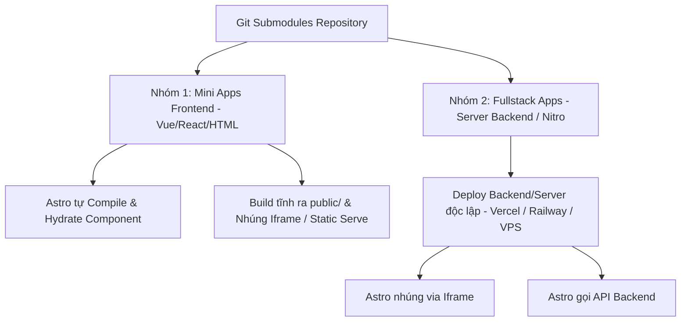

# 📖 Hướng Dẫn Tích Hợp Submodule & Nhúng Web App/Game vào Astro Portfolio

Tài liệu này hướng dẫn chi tiết quy trình quản lý dự án phụ (Mini Games, Tools, Fullstack Apps) thông qua **Git Submodule** và nhúng vào trang **Playground (`/playground`)** của dự án Astro Portfolio.

---

## 🏗️ Tổng Quan Kiến Trúc (Architecture Overview)

Chúng ta chia các ứng dụng nhúng thành **2 nhóm chính**:



---

## 🔹 HƯỚNG 1: GAME / MINI-APP NHỎ (Client-Only / Pure Frontend)

Áp dụng cho các ứng dụng chạy hoàn toàn trên trình duyệt (Vue.js, React, HTML5 Canvas) không có server riêng.

### 📌 Option 1A: Import Root Component Trực Tiếp (Astro Tự Build - Khuyên Dùng)

Astro có khả năng bundle trực tiếp component React / Vue từ submodule mà **không cần chạy build riêng ở repo phụ**.

#### Các bước thực hiện:

1. **Thêm Submodule vào thư mục `src/apps/`:**
   ```bash
   git submodule add https://github.com/username/my-vue-game.git src/apps/my-vue-game
   ```

2. **Cài đặt Framework Integration cho Astro (Ví dụ Vue):**
   ```bash
   npx astro add vue
   ```

3. **Nhúng vào trang Playground (`src/pages/playground/my-vue-game.astro`):**
   ```astro
   ---
   import Layout from '../../layouts/Layout.astro';
   // Import trực tiếp file App.vue từ submodule!
   import MyVueApp from '../../apps/my-vue-game/src/App.vue';
   ---

   <Layout title="My Vue Game">
     <div class="max-w-4xl mx-auto py-8">
       <!-- client:load giúp kích hoạt Javascript Hydration cho Vue -->
       <MyVueApp client:load />
     </div>
   </Layout>
   ```

- ✅ **Ưu điểm:** Tích hợp sâu, đồng bộ CSS/UI với Portfolio, load nhanh.
- ❌ **Nhược điểm:** Phải cài đúng framework adapter cho Astro (`@astrojs/vue`, `@astrojs/react`).

---

### 📌 Option 1B: Build Thành File Tĩnh Ra `public/` & Nhúng Iframe / Standalone Page

Áp dụng khi dự án phụ có cấu hình build phức tạp (Vue Router, Tailwind riêng, Vite plugins độc lập) không muốn đụng tới config của Astro.

#### Các bước thực hiện:

1. **Build ra HTML/JS/CSS tĩnh ở Repo phụ:**
   ```bash
   cd src/apps/my-vue-game
   npm run build
   # Kết quả tạo ra thư mục dist/
   ```

2. **Copy / Symlink thư mục `dist` vào `public/playground-apps/my-vue-game/`:**
   Dự án Astro sẽ phục vụ đường dẫn: `https://your-portfolio.com/playground-apps/my-vue-game/index.html`

3. **Nhúng vào trang Astro via Iframe (`src/pages/playground/my-vue-game.astro`):**
   ```astro
   ---
   import Layout from '../../layouts/Layout.astro';
   const appUrl = `${import.meta.env.BASE_URL}/playground-apps/my-vue-game/index.html`;
   ---

   <Layout title="My Vue Game">
     <div class="w-full h-[700px] rounded-2xl overflow-hidden border border-gray-200 shadow-lg">
       <iframe src={appUrl} class="w-full h-full border-0"></iframe>
     </div>
   </Layout>
   ```

- ✅ **Ưu điểm:** Cách ly 100% môi trường, không lo xung đột thư viện.
- ❌ **Nhược điểm:** Hiển thị qua Iframe, khó chia sẻ CSS global.

---

## 🔸 HƯỚNG 2: GAME / FULLSTACK APP LỚN (Cần Server Backend / Nitro / Database)

### 💡 Câu hỏi: *"Không build UI ra rồi nhúng trực tiếp vào app hiện tại (Astro), rồi UI đó tự call tới BE Nitro riêng được không?"*

👉 **CÂU TRẢ LỜI: ĐƯỢC 100%! VÀ ĐÂY LÀ CÁCH LÀM RẤT TỐI ƯU (Option 2B).**

Bạn có 2 lựa chọn triển khai cho ứng dụng có Backend Nitro:

```text
               ┌─────────────────────────────────────────────────────────────┐
               │                  ASTRO PORTFOLIO FRONTEND                   │
               │                                                             │
               │  [Option 2A: Iframe]        [Option 2B: Native UI Component]│
               │   <iframe src="...">         <MyVueGame client:load />      │
               └──────┬──────────────────────────────────┬───────────────────┘
                      │                                  │
                      │ HTTP / Embed                     │ Fetch API / REST / WS
                      ▼                                  ▼
               ┌─────────────────────────────────────────────────────────────┐
               │              INDEPENDENT NITRO BACKEND SERVER               │
               │       (Deploy trên Vercel / Railway / Render / VPS)         │
               └─────────────────────────────────────────────────────────────┘
```

---

### 📌 Option 2A: Full App Iframe
Deploy cả Frontend + Backend của dự án phụ thành 1 web hoàn chỉnh tại domain riêng (vd: `game.yourdomain.com`), sau đó nhúng bằng `<iframe src="https://game.yourdomain.com">`.

---

### 📌 Option 2B: Native UI trong Astro + Call Nitro Backend Riêng (Khuyên Dùng)

Ở phương án này:
1. **Frontend UI (Vue/React Component)**: Nằm trong Submodule `src/apps/my-fullstack-game`. Astro tự **compile và render trực tiếp** thành component trên trang Portfolio (không xài Iframe, chung giao diện/Tailwind với Portfolio).
2. **Backend Engine (Nitro/Node.js/Database)**: Được deploy riêng biệt trên Vercel / Railway / Render / VPS (Ví dụ tại API URL: `https://api-game.yourdomain.com`).

#### Các bước triển khai Option 2B:

**Step 1: Trong Component Vue (nằm ở Submodule `src/apps/my-fullstack-game/src/App.vue`)**
Gọi API tới Server Nitro Backend bằng `fetch` hoặc `axios`:

```vue
<template>
  <div class="p-6 bg-white rounded-2xl shadow border border-gray-100">
    <h2 class="text-xl font-bold mb-4">🏆 Bảng Xếp Hạng Game</h2>
    <ul>
      <li v-for="item in leaderboard" :key="item.id">
        {{ item.username }}: {{ item.score }} điểm
      </li>
    </ul>
  </div>
</template>

<script setup>
import { ref, onMounted } from 'vue';

const leaderboard = ref([]);
// Lấy URL Backend từ biến môi trường (hoặc fix cứng domain BE)
const API_URL = import.meta.env.PUBLIC_API_GAME_URL || 'https://api-game.yourdomain.com';

onMounted(async () => {
  try {
    const res = await fetch(`${API_URL}/api/leaderboard`);
    leaderboard.value = await res.json();
  } catch (err) {
    console.error('Lỗi kết nối Backend:', err);
  }
});
</script>
```

**Step 2: Trong Trang Astro (`src/pages/playground/my-fullstack-game.astro`)**
Import và nhúng component Vue trực tiếp:

```astro
---
import Layout from '../../layouts/Layout.astro';
import MyFullstackVueGame from '../../apps/my-fullstack-game/src/App.vue';
---

<Layout title="Fullstack Game với Nitro Backend">
  <div class="max-w-4xl mx-auto py-8">
    <!-- client:load giúp kích hoạt Vue JS trên trình duyệt để gọi API -->
    <MyFullstackVueGame client:load />
  </div>
</Layout>
```

---

### ⚠️ Lưu ý kỹ thuật quan trọng cho Option 2B:

1. **Cấu hình CORS ở Nitro Backend**:
   Vì UI chạy ở domain Portfolio (`https://portfolio.com`) mà gọi API sang Nitro (`https://api-game.yourdomain.com`), Nitro Backend **phải bật CORS** cho phép domain Portfolio truy cập:
   ```typescript
   // Trong repo Nitro Backend: server/middleware/cors.ts
   export default defineEventHandler((event) => {
     setResponseHeaders(event, {
       'Access-Control-Allow-Origin': '*', // Hoặc 'https://your-portfolio.com'
       'Access-Control-Allow-Methods': 'GET, POST, PUT, DELETE, OPTIONS',
       'Access-Control-Allow-Headers': 'Content-Type, Authorization',
     });
   });
   ```

2. **Tối ưu hóa**:
   - Giao diện (UI) mượt mà 100% như native component của Astro.
   - Thích hợp cho các game cần lưu Điểm (Leaderboard), Đăng nhập (Auth), hoặc Chat/Multiplayer realtime qua WebSocket.

---

## 🛠️ Cheat Sheet: Lệnh Quản Lý Git Submodule

Thao tác làm việc với Submodule trên máy local:

1. **Clone project Portfolio đã bao gồm tất cả Submodule:**
   ```bash
   git clone --recurse-submodules https://github.com/username/portfolio.git
   ```

2. **Cập nhật tất cả Submodule lên commit mới nhất:**
   ```bash
   git submodule update --remote --merge
   ```

3. **Thêm mới 1 Submodule:**
   ```bash
   git submodule add <URL_GIT_REPO> src/apps/<TEN_APP>
   ```

4. **Xóa 1 Submodule:**
   ```bash
   git submodule deinit -f src/apps/<TEN_APP>
   rm -rf .git/modules/src/apps/<TEN_APP>
   git rm -f src/apps/<TEN_APP>
   ```

---

## 💡 Tổng Kết & Đề Xuất Quy Trình Cho Bạn

| Loại App / Game | Công nghệ | Hướng nhúng khuyến nghị | Trải nghiệm |
| :--- | :--- | :--- | :--- |
| **Game nhỏ 1** (TicTacToe, Memory, Mini Tool) | React / Vue | **Option 1A** (Import `.vue` / `.tsx` trực tiếp) | 🌟 Tối ưu nhất |
| **Game vừa** (Canvas, HTML5, PhaserJS) | Pure JS / Vue | **Option 1B** (Build tĩnh ra `public/` & Iframe) | ⚡ Nhanh & Độc lập |
| **App/Game lớn** (Multiplayer, Leaderboard, Nitro) | Fullstack (Vue + Nitro/Node) | **Option 2** (Deploy Server riêng & Nhúng Iframe) | 🚀 An toàn & Mở rộng được |

# 📦 Hướng Dẫn Build Web App Thành Single File Bundle (IIFE / UMD / Custom Element)

Hướng dẫn này giải thích cách đóng gói một dự án phụ (Vue/React/Vanilla JS) thành **1 file `.js` hoặc `.html` duy nhất**, sau đó nhúng trực tiếp vào Astro dưới dạng **Web Component (Custom Element)** hoặc **Script IIFE**, không cần sử dụng `iframe` hay cài thêm plugin `@astrojs/vue`.

---

## 🎯 Ý Tưởng & Ưu Điểm
- **Đóng gói gọn nhẹ:** Dự án Vue/React build ra **duy nhất 1 file JS** (chứa cả JS + CSS trong đó).
- **Không Iframe:** Chạy trực tiếp trên DOM của Astro, hiệu năng cao.
- **Không phụ thuộc Astro:** Astro không cần biết dự án phụ dùng framework gì, chỉ cần nạp 1 file Script.

---

## 🚀 CÁCH 1: Build Vue 3 Thành Custom Element (Web Component)

Vue 3 hỗ trợ sẵn tính năng chuyển đổi Component thành Web Component tiêu chuẩn của trình duyệt.

### Step 1: Config Vue App (`vite.config.js` ở Repo Phụ)

```javascript
import { defineConfig } from 'vite';
import vue from '@vitejs/plugin-vue';

export default defineConfig({
  plugins: [
    vue({
      template: {
        compilerOptions: {
          // Coi các thẻ custom-element là web component
          isCustomElement: (tag) => tag.includes('-')
        }
      }
    })
  ],
  build: {
    lib: {
      entry: 'src/main.js',
      name: 'MyVueGame',
      fileName: 'my-vue-game',
      formats: ['iife'] // Build thành 1 file IIFE duy nhất chạy trực tiếp trên browser
    },
    rollupOptions: {
      output: {
        // Đóng gói tất cả CSS nhúng trực tiếp vào file JS duy nhất
        inlineDynamicImports: true
      }
    }
  }
});
```

### Step 2: Khai Báo Custom Element (`src/main.js` ở Repo Phụ)

```javascript
import { defineCustomElement } from 'vue';
import GameComponent from './App.vue';

// Chuyển Vue Component thành Web Component tiêu chuẩn
const CustomGameElement = defineCustomElement(GameComponent);

// Đăng ký thẻ HTML mới với trình duyệt: <my-vue-game></my-vue-game>
customElements.define('my-vue-game', CustomGameElement);
```

### Step 3: Nhúng Vào Astro (`src/pages/playground/my-game.astro`)

Copy file build `my-vue-game.js` vào folder `public/apps/` của Astro Portfolio:

```astro
---
import Layout from '../../layouts/Layout.astro';
const base = import.meta.env.BASE_URL.replace(/\/$/, "");
---

<Layout title="My Vue Game">
  <div class="max-w-4xl mx-auto py-8">
    <!-- 1. Nạp file script đã build -->
    <script is:inline src={`${base}/apps/my-vue-game.js`}></script>

    <!-- 2. Sử dụng thẻ Custom Element trực tiếp trong HTML -->
    <my-vue-game></my-vue-game>
  </div>
</Layout>
```

---

## ⚡ CÁCH 2: Build Thành File JS IIFE / UMD Mount Trực Tiếp Vào Div

Nếu không muốn dùng Custom Element, bạn có thể build dạng IIFE và dùng một hàm `mountApp(elementId)` đơn giản.

### Step 1: File Khởi Tạo (`src/main.js` ở Repo Phụ)

```javascript
import { createApp } from 'vue';
import App from './App.vue';
import './style.css'; // Nếu có CSS

// Gắn hàm mount vào window để gọi từ bên ngoài
window.mountMyGame = function (targetSelector, props = {}) {
  const app = createApp(App, props);
  app.mount(targetSelector);
  return app;
};
```

### Step 2: Config Build 1 File (`vite.config.js` ở Repo Phụ)

Dùng plugin `vite-plugin-singlefile` để gộp toàn bộ code + css + assets vào 1 file JS duy nhất:

```bash
npm install -D vite-plugin-singlefile
```

```javascript
import { defineConfig } from 'vite';
import vue from '@vitejs/plugin-vue';
import { viteSingleFile } from 'vite-plugin-singlefile';

export default defineConfig({
  plugins: [vue(), viteSingleFile()],
  build: {
    target: 'esnext',
    assetsInlineLimit: 100000000, // Inline toàn bộ hình ảnh/assets thành base64
  }
});
```

### Step 3: Nhúng Vào Astro (`src/pages/playground/my-game.astro`)

```astro
---
import Layout from '../../layouts/Layout.astro';
const base = import.meta.env.BASE_URL.replace(/\/$/, "");
---

<Layout title="My Vue Game">
  <div class="max-w-4xl mx-auto py-8">
    <!-- Div chứa Game -->
    <div id="game-root"></div>

    <!-- Script nạp bundle và Mount game -->
    <script is:inline src={`${base}/apps/my-game-bundle.js`}></script>
    <script is:inline>
      document.addEventListener('DOMContentLoaded', () => {
        if (window.mountMyGame) {
          window.mountMyGame('#game-root', { apiBase: 'https://api-game.com' });
        }
      });
    </script>
  </div>
</Layout>
```

---
## UMD
❓ UMD là gì và khác gì IIFE?
IIFE (Immediately Invoked Function Expression): Chỉ chạy trực tiếp bằng cách gán hàm/object vào window (ví dụ window.MyGame). Chuyên dùng để nhúng trực tiếp bằng thẻ <script src="..."> trên browser.
UMD (Universal Module Definition): Là định dạng "đa năng". File JS sau khi build theo chuẩn UMD sẽ tự động nhận diện môi trường chạy:
Nếu chạy bằng thẻ <script src="..."> trên browser ➔ Tự động gán vào window (giống hệt IIFE).
Nếu dùng trong Node.js (CommonJS) ➔ Tự hỗ trợ module.exports.
Nếu dùng trong RequireJS (AMD) ➔ Tự hỗ trợ define()
umd không cần module, nhúng html thuần dễ nhưng bundle lớn công nghệ cũ iife gọn nhẹ hơn phù hợp chyaj độc lập

vd umd
``` js
(function (root, factory) {
  root.PortfolioWidget = factory();
})(this, function () {
  return {
    hello() {
      console.log("hello");
    }
  };
});
// khi nhúng
<script src="/get.jsscript>

<script>
  PortfolioWidget.hello();
</script>
```
### 1. Hướng dẫn Config build UMD trong Vite (Repo Vue phụ)
Trong dự án Vue phụ của bạn, sửa file vite.config.js:
```javascript
import { defineConfig } from 'vite';
import vue from '@vitejs/plugin-vue';
import { viteSingleFile } from 'vite-plugin-singlefile';

export default defineConfig({
  plugins: [vue(), viteSingleFile()],
  build: {
    lib: {
      entry: 'src/main.js',
      name: 'MyVueGame',      // Tên biến global sẽ được gán vào window.MyVueGame
      fileName: 'my-vue-game',
      formats: ['umd']         // 👈 Đặt format là UMD
    },
    rollupOptions: {
      output: {
        // Tên biến global đại diện cho các thư viện nếu có xài external
        globals: {
          vue: 'Vue'
        }
      }
    }
  }
});
```
### 2. Khai báo export trong Vue App (src/main.js repo phụ):
``` javascript
import { createApp } from 'vue';
import App from './App.vue';

// Export hàm mount để UMD biến thành phương thức của Window object
export function mount(target, props = {}) {
  const app = createApp(App, props);
  app.mount(target);
  return app;
}

```

### 3.  Cách nhúng file UMD vào Astro (my-game.astro):
Khi nạp file UMD qua thẻ <script is:inline>, Vite/Rollup tự động gán tất cả export thành một Object ở window[LibraryName] (ở đây là window.MyVueGame):
```js
---
import Layout from '../../layouts/Layout.astro';
const base = import.meta.env.BASE_URL.replace(/\/$/, "");
---

<Layout title="My Vue Game (UMD)">
  <div class="max-w-4xl mx-auto py-8">
    <!-- Div chứa Game -->
    <div id="game-root"></div>

    <!-- 1. Nạp file JS UMD duy nhất -->
    <script is:inline src={`${base}/apps/my-vue-game.umd.js`}></script>

    <!-- 2. Gọi hàm mount từ Global Object của UMD -->
    <script is:inline>
      document.addEventListener('DOMContentLoaded', () => {
        // window.MyVueGame chính là name khai báo trong config vite
        if (window.MyVueGame && typeof window.MyVueGame.mount === 'function') {
          window.MyVueGame.mount('#game-root', {
            apiUrl: 'https://api-game.com'
          });
        }
      });
    </script>
  </div>
</Layout>

```
 Tóm lại:
Khi dùng trên Browser với trang Astro, UMD và IIFE hoạt động giống hệt nhau (đều tạo ra 1 file JS duy nhất và đính tên Game vào window).
UMD nhỉnh hơn IIFE ở chỗ: File JS đó sau này nếu bạn muốn import vào một dự án React/NodeJS khác để tái sử dụng thì vẫn import hoặc require được bình thường
---

## 📊 So Sánh 2 Phương Pháp Single-File

| Tiêu chí | Cách 1: Custom Element (Web Component) | Cách 2: IIFE / UMD Mount Function |
| :--- | :--- | :--- |
| **Cách nhúng** | Dùng thẻ HTML: `<my-vue-game></my-vue-game>` | Dùng div `<div id="app"></div>` + gọi hàm `mount()` |
| **Cô lập CSS** | Shadow DOM (Cô lập 100%, không lo trùng CSS với Astro) | Phụ thuộc CSS Scoped trong Vue |
| **Truyền Props** | Truyền qua HTML Attributes (`<my-game api-url="...">`) | Truyền qua tham số hàm JS (`mountMyGame('#app', { ... })`) |
| **Dễ thực hiện** | Hỗ trợ cực tốt trong Vue 3 với `defineCustomElement` | Cần plugin `vite-plugin-singlefile` |
